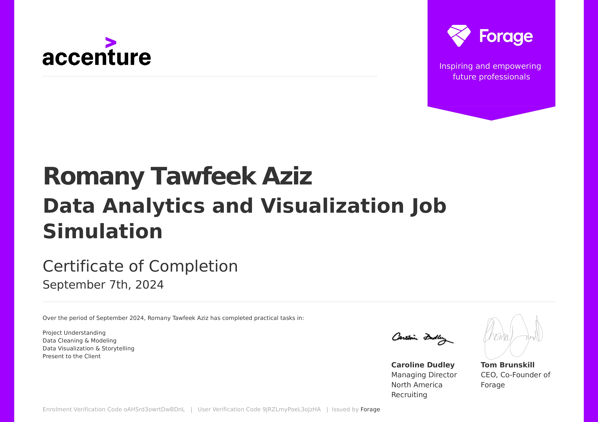

# Accenture Data Analytics and Visualization Virtual Internship
## Certificate:

During my virtual internship with Accenture, I had the opportunity to work on a data analytics and visualization project. Here’s a summary of the tasks and insights gained throughout the internship:

### Task 1: Project Understanding
As a data analyst, I acted as a bridge between the business and the data. The client, Social Buzz, tasked Accenture with addressing several challenges as the company scaled rapidly. The project was led by Mae Mulligan, Managing Director at Accenture.

Client Problem:
Social Buzz required assistance in three key areas:

- Audit of their big data practices
- Recommendations for an IPO
- Analysis of popular content

My role as a Data Analyst: I was responsible for analyzing sample data to provide insights into the top five content categories with the highest popularity.
About Client : [Social Buzz](https://github.com/DE-romane/Accenture-Internship-Data-Analytics-and-Visualization/blob/main/Data_Analytics%20Client%20Brief.pdf)

 #### Accenture Project Team :
 

## Task 2: Data Preparation and Cleaning
The first step was identifying which datasets would be necessary for the analysis. Using the provided [data model](https://github.com/DE-romane/Accenture-Internship-Data-Analytics-and-Visualization/blob/main/Data%20model.pdf), I focused on the following key data points:
- Reaction Score (used to quantify content popularity)
- Content ID
- Reaction Types
- Content Type
- Category

### Data Cleaning:
I performed data cleaning by:
- Removing rows with missing values
- Converting data types where needed
- Removing irrelevant columns

As a result, three cleaned datasets were created:
- [Reaction Types](https://github.com/DE-romane/Accenture-Internship-Data-Analytics-and-Visualization/blob/main/Cealned_data/ReactionTypes.xlsx)
- [Reactions](https://github.com/DE-romane/Accenture-Internship-Data-Analytics-and-Visualization/blob/main/Cealned_data/Reactions.xlsx)
- [Content](https://github.com/DE-romane/Accenture-Internship-Data-Analytics-and-Visualization/blob/main/Cealned_data/Content.xlsx)
 
### Data Modeling and Analysis

To move forward with the analysis, I merged the cleaned datasets, creating a final comprehensive dataset. From this, I analyzed the data to identify the top five content categories with the largest popularity.

The cleaned and modeled dataset can be found here: [Cleaned Dataset](https://github.com/DE-romane/Accenture-Internship-Data-Analytics-and-Visualization/blob/main/Cealned_data/Cleaned%20Dataset.xlsx)

 
 ## Task 3: Data Visualization and Storytelling
Next, I created visualizations to present the findings. Using tools like PowerPoint, I presented the data with pie charts and bar charts, ensuring the insights were easy to understand for stakeholders.

Here is the presentation: [PPT](https://github.com/DE-romane/Accenture-Internship-Data-Analytics-and-Visualization/blob/main/Data%20Analysis%20Presentation.pptx)

## Task 4: Client Presentation
Finally, I presented the PowerPoint and delivered the insights to the client. This step was crucial in communicating how the analysis could guide future decisions and strategies for Social Buzz's content popularity and IPO readiness. 
